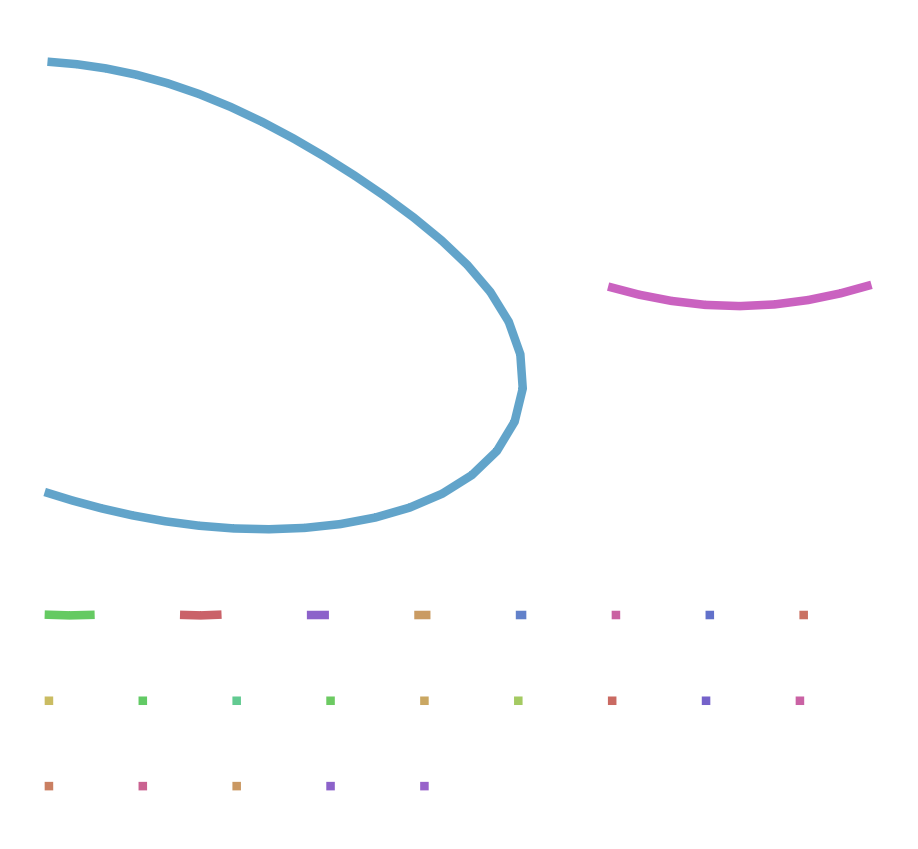

## Revisión de los datos

Los datos de los que disponemos están en formato FASTA y contienen datos de alta calidad, pero `hifiasm` no necesita esta información de las lecturas. Antes de empezar a trabajar con ellos deberíamos tener una idea de la cantidad de datos que tenemos.

::: callout-note
### Ejercicio 1

- ¿Cuántas secuencias contiene el archivo?

  `zgrep -c "^>" ../../data/At4.10.fa`

  El archivo contiene 13812 secuencias.

- ¿Qué longitudes mínima, media y máxima tienen las secuencias?

  `cat At4.10.fa | awk '/^>/ {if(l>0){s+=l;count++;if(l>max)max=l;if(l<min||min==0)min=l}l=0;next}{l+=length($0)}END{if(l>0){s+=l;count++;if(l>max)max=l;if(l<min||min==0)min=l}printf "Mínima: %d\nMedia: %.2f\nMáxima: %d\nTotal Bases: %d\nNum Secuencias: %d\n", min, s/count, max, s, count}'`

  La longitud mínima es 2942 pb, la media 18143,61 y la máxima 59075 pb.

- ¿Cuál es el número total de bases?

  Hay un total de 250599484 bases

- Si se estimara que el genoma a ensamblar fuera de sólo 19 millones de bases, ¿cuál sería la cobertura esperada?

  `cat At4.10.fa | awk '/^>/ {next} {sum += length($0)} END {print "Cobertura esperada: " sum/19000000 "X"}'`

  La cobertura esperada es de 13,1894X
:::

## Ensamblaje

Como `hifiasm` produce varios archivos de salida en el ensamblaje, creamos la carpeta `asm1` para almacenarlos de una forma más ordenada dentro de la carpeta de resultados:

```{bash}
if [ ! -d asm1 ]; then
  mkdir asm1
fi
if [ ! -e asm1/At4.bp.p_ctg.gfa ]; then
  hifiasm -o asm1/At4 -t 2 -f 0 ../../data/At4.10.fa 2> asm1/hifiasm.log
fi
```

Los parámetros utilizados indican lo siguiente:

- `-o asm1/At4` indica el prefijo de todos los archivos de salida, por lo que se guardarán en la carpeta `asm1` y empiezan todos por `At4`.

- `-t 2` para usar dos procesadores en lugar de uno.

- `-f 0` inhabilita el uso de un filtro que ocuparía demasiado espacio.

- `../../data/At4.10.fa` indica el archivo con los datos de partida.

- `2> asm1/hifiasm-log` guarda los mensajes que surgen durante el proceso.

::: callout-note
### Ejercicio 2

Consulta la ayuda de `hifiasm` (`hifiasm -h`) y contesta las preguntas siguientes:

1.  ¿Los parámetros corresponden al ensamblaje de un genoma haploide o diploide?

    Se corresponde a un genoma haploide. El parámetro `-f` indica la cobertura esperada en una región homocigota, pero al haber indicado que es 0 se asume que no hay regiones homocigotas porque es un genoma haploide.

2.  ¿Qué nivel de eliminación de duplicaciones hemos aplicado? (El paso de eliminar duplicaciones sirve para que las zonas de alta heterocigosidad no sean ensambladas como contigs diferentes).

    Esto se indica con el parámetro `-r`, pero como elimina repeticiones en zonas de alta heterocigosidad y tenemos un genoma haploide, no hay zonas heterocigotas, por lo que no es necesario.

3.  Si tuvieramos lecturas ultra-largas, ¿con qué opción o argumento añadiríamos esa información?

    Los parámetros `--ul FILEs`, `--ul-rate`, `--ul-tip`, `--path-max`, `--path-min` y `--ul-cut` sirven para añadir información sobre lecturas ultra-largas.
:::

## Evaluación del resultado

::: callout-note
### Ejercicio 3

Consulta la descripción de los archivos de salida que encontrarás en [este enlace](#0) y contesta las preguntas siguientes:

1.  ¿Dónde están las secuencias que componen el ensamblaje?

    El archivo `At4.bp.p_ctg.gfa` de la carpeta `asm1` contiene el ensamblaje de los contigs.

2.  En los archivos `.gfa`, ¿qué son las líneas que empiezan por ‘A’?

    Las líneas que empiezan por 'A' proporcionan información sobre las lecturas utilizadas para construir un contig alineado con la lectura original.

3.  ¿Qué información tiene los archivos `.bed`?

    Contienen las coordenadas de las regiones de poca calidad.

4.  ¿Cuál es la cobertura media estimada de las secuencias homocigotas?

    En el archivo `hifiasm.log` se especifica que la cobertura media estimada para las secuencias homocigotas es 12.

5.  ¿Y la de las heterocigotas?

    Como el genoma era haploide no podemos estimar la cobertura de las regiones heterocigotas. En el archivo `hifiasm.log` se representan las curvas de frecuencia de k-meros, en las que se observa un solo pico, lo que confirma que no hay regiones heterocigotas.
:::

Podemos extraer los ensamblajes en formato fasta de la siguiente manera:

```{bash}
awk '(/^S/){print ">" $2 "\n" $3}' asm1/At4.bp.p_ctg.gfa > asm1/At4.fa
```

### Calidad del ensamblaje

```         
(no he conseguido utilizar compleasm)
```

```{bash}
#| eval: false
#| include: true
if [ ! -e asm1_eval/summary.txt ]; then
    python3 ~bin/compleasm_kit/compleasm.py run \
    -t 2 -l brassicales -a asm1/At4.fa -o asm_eval
fi
```

::: callout-note
### Ejercicio 4

Consulta la ayuda de `compleasm.py` y averigua qué significan los argumentos utilizados.

- `-t 2`: Indica el número de procesadores que debe utilizar el programa para acelerar el análisis.

- `-l brassicales`: Es el orden al que pertenece Arabidopsis thaliana. Indica al programa en qué grupo debe buscar los genes para evaluar la calidad del ensamblaje.

- `-a asm1/At4.fa`: Archivo de entrada.

- `-o asm1_eval`: Archivo de salida.
:::

### Visualización del grafo

Para visualizar ensamblajes como grafos de fragmentos a partir de archivos `.gfa` podemos usar el visualizador `bandage`.

::: callout-note
## Ejercicio 5

Instala `bandage`, carga el grafo del ensamblaje realizado y genera una figura. Puedes añadir la figura al informe HTML mediante la [sitaxis siguiente](#0):


:::
